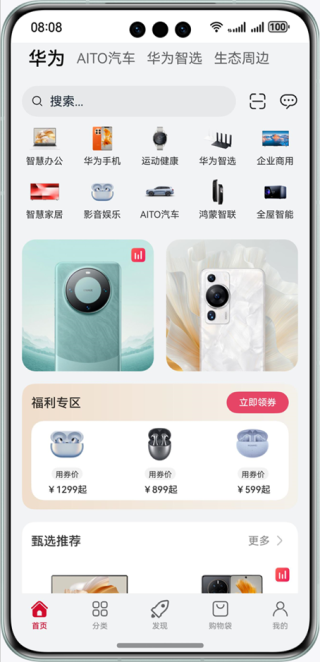
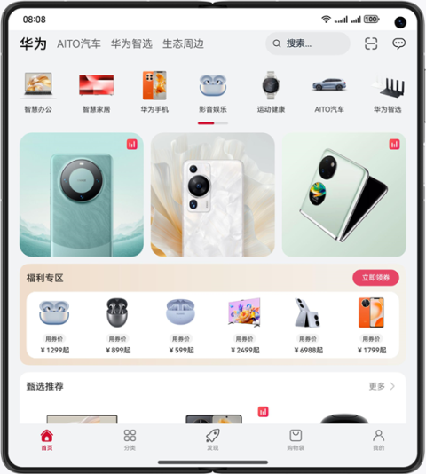
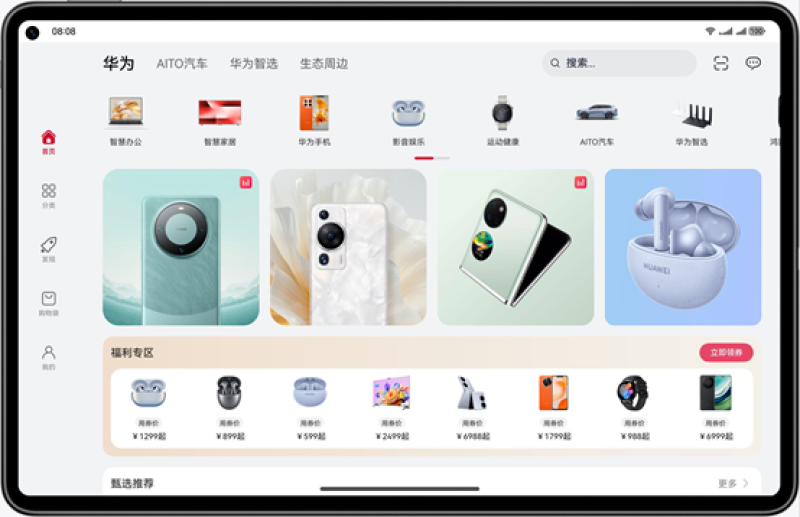

# BiJia BiHuo — Multi-Device Shopping Price Comparison

### Introduction

This HarmonyOS application implements a **one-time development, multi-device deployment** shopping price comparison platform using adaptive and responsive layouts. Built with a **three-layer project architecture** for code reuse, it automatically adapts its UI across phones, foldables, tablets, and PC/2-in-1 devices.

Core features include: multi-platform price comparison, product search, shopping cart, live streaming (PiP), **Cross-Device Continuation (自由流转)**, and **AirDrop-style Sharing (隔空投送)**.

---

## Screenshots

| Bar Phone | Foldable (Mate X) | Tablet |
|-----------|-------------------|--------|
|  |  |  |

---

## Three Core Features

### 1. One-Time Development, Multi-Device Deployment

A single codebase adapts to all device form factors.

| Feature | Implementation |
|---------|---------------|
| **Breakpoint System** | SM (320–599vp, 4-col grid), MD (600–839vp, 8-col), LG (≥840vp, 12-col) |
| **Generic Breakpoint Type** | `BreakpointType<T>` returns device-appropriate values per breakpoint |
| **Grid Layout** | 5 views use `GridRow`/`GridCol`; 16 of 17 views consume `currentBreakpoint` |
| **Device Coverage** | `phone`, `tablet`, `2in1` (foldable) |
| **Fold Status** | Real-time `foldStatusChange` event listener for foldable adaptation |
| **Split-Screen Compare** | SideBarContainer + SecondAbility on LG for side-by-side product comparison |

**Architecture Layers:**

```
AppScope/                  ← App entry + icon resources
products/phone/            ← Product layer (EntryAbility + page routing)
features/home/             ← Home feature (5 tabs)
features/detail/           ← Detail feature (product + live)
commons/base/              ← Shared layer (utils, data, breakpoints, share, continuation)
```

---

### 2. Cross-Device Continuation (自由流转)

Seamlessly transfer app state from one device to another while browsing products or searching.

| Stage | Implementation |
|-------|---------------|
| **State Capture** | 5 UI pages call `ContinuationManager.updateState()` on state change |
| **Packaging** | `EntryAbility.onContinue()` serializes `ContinuationState` into Want params |
| **Restoration** | Target device `onCreate()`/`onNewWant()` deserializes and navigates via `NavPathStack` |
| **Fields Restored** | Tab index, current page route, product ID, search keyword, live status |
| **Permissions** | `continuable: true` + `ohos.permission.DISTRIBUTED_DATASYNC` |

**Flow:**

```
Source Device                        Target Device
  │                                    │
  ├─ UI updates ContinuationManager
  │                                    │
  ├─ onContinue() ◄── System trigger
  │   └─ Pack 5 fields into Want
  │                                    │
  │   ──── Want transfer ────────►    │
  │                                    │
  │                             onCreate()/onNewWant()
  │                                └─ restoreFromParams()
  │                                    │
  │                             Index.ets aboutToAppear()
  │                                ├─ Restore tab → Home.ets
  │                                ├─ Set CURRENT_PRODUCT_ID_KEY
  │                                └─ pushPathByName() navigate
```

---

### 3. AirDrop-Style Sharing (隔空投送)

Nearby device discovery and data transfer with AirDrop-inspired UI, supporting product and app data sharing.

| Module | File | Responsibility |
|--------|------|----------------|
| **State Machine** | `TransferState` | IDLE → DISCOVERING → CONNECTING → TRANSFERRING → DONE / ERROR |
| **Discovery** | `DeviceDiscoveryManager` | Real API ready + 3 mock Huawei devices, 8s timeout |
| **Transfer** | `DataTransferManager` | Sine-wave progress simulation + distributed KV store integration point |
| **Orchestration** | `ShareSessionManager` | Singleton coordinating discovery & transfer, max 3 retries |
| **Send UI** | `ShareSheet` | Radar animation → device list → circular progress → success/failure/retry |
| **Receive UI** | `ReceiveNotification` | Top slide-in card with payload preview, accept/decline buttons |
| **Payload Builders** | `DetailShareHelper` / `MineShareHelper` | Product data / favorites + history JSON serialization |

**Entry Points:**

| Page | Trigger | Shared Content |
|------|---------|----------------|
| ProductHome | More button (top-right) | Product name, price, platform comparisons |
| ProductDetail | Share icon | Same as above |
| ProductUtilView | Share button in action bar | Same as above |
| MineContent | "Share App Data" button | Favorites + browsing history |

**Complete Send → Receive Flow:**

```
ShareSheet                              ReceiveNotification
  │                                           │
  ├─ startDiscovery()                         │
  │   └─ Radar animation + device list        │
  │                                           │
  ├─ User taps device                         │
  │   └─ sendToDevice()                       │
  │       └─ Simulated progress 0→100%        │
  │           └─ Circular progress ring       │
  │                                           │
  ├─ DONE ──► storeReceivedData() ──► AppStorage
  │                                           │
  │                              Data notification (slide-in card)
  │                              ├─ Product / App data preview
  │                              ├─ Accept → confirm
  │                              └─ Decline → dismiss
```

---

## Technical Analysis

### Architecture

Three-layer HAR modular architecture:

| Layer | Module | Type | Description |
|-------|--------|------|-------------|
| Product | `products/phone` | entry | App entry, page routing, Ability lifecycle |
| Feature | `features/home` | har | Home with 5 tabs, search, profile |
| Feature | `features/detail` | har | Product details, live streaming, pricing, payment |
| Foundation | `commons/base` | har | Utilities, data repo, breakpoint system, sharing, continuation |

### Data Flow

```
ProductRepository (singleton data store)
  │
  ├─► Home → Recommended, welfare, flash sale products
  ├─► SearchView → Real-time keyword filtering
  ├─► ProductHome → Detail + multi-platform pricing
  ├─► DetailShareHelper → Product share payload
  └─► MineContent → Favorites + browsing history
```

### State Management

| Mechanism | Usage |
|-----------|-------|
| `AppStorage` | Global shared state: breakpoint, window width, current product ID, share data |
| `@StorageLink` | Two-way component binding to AppStorage |
| `@Provide/@Consume` | Parent-child `NavPathStack` passing |
| `@State` | Component-local state |
| `ContinuationManager` | Cross-device continuation state cache |

### Key APIs

| API | Purpose |
|-----|---------|
| `@kit.ArkUI` (Navigation + NavPathStack) | Declarative page routing |
| `@kit.AbilityKit` (UIAbility, Want) | App lifecycle + continuation |
| `display.on('foldStatusChange')` | Foldable screen state monitoring |
| `PiPWindow` | Picture-in-picture live streaming |
| `@kit.BasicServicesKit` (deviceInfo) | Device type detection |
| `@kit.DistributedServiceKit` (reserved) | Real distributed device discovery |
| `@kit.ArkData` (reserved) | Real distributed KV store transfer |

---

## Concepts

- **One-Time Multi-Device Deployment**: Single codebase for all device types via breakpoint system and resource qualifiers.
- **Adaptive Layout**: Elements adjust by relative relationships (proportion, aspect ratio, priority).
- **Responsive Layout**: Elements change by breakpoints, grids, and screen orientation — this project uses SM/MD/LG breakpoints.
- **Cross-Device Continuation**: App state migration across devices for seamless operation.
- **AirDrop-Style Sharing**: Simulated AirDrop via device discovery + data transfer for proximity sharing.
- **GridRow / GridCol**: Grid layout components for responsive grids.
- **Picture-in-Picture (PiP)**: Video in floating overlay window.
- **Three-Layer Architecture**: commons (shared) + features (business) + products (entry) for maximum reuse.

---

## Permissions

| Permission | Purpose |
|------------|---------|
| `ohos.permission.INTERNET` | Network data transfer |
| `ohos.permission.DISTRIBUTED_DATASYNC` | Distributed device discovery & sync (continuation + sharing) |

---

## How to Use

### Basic Operations

1. Install on bar phone, foldable, or tablet — UI adapts automatically
2. Browse recommended products, welfare deals, flash sales on home page
3. Switch tabs: Categories, Shopping Bag, Profile
4. Tap product → detail page with **multi-platform price comparison** (JD, Taobao, Pinduoduo, Suning, Huawei Mall)
5. On tablet: tap split-screen button to compare products side-by-side
6. Tap "Live" to enter streaming room; close button triggers **PiP mode**
7. Search bar supports real-time filtering with search history

### Cross-Device Continuation

1. Open app on Device A, browse a product or enter a search query
2. Trigger cross-device migration (pull down task card → continue button)
3. On Device B, app auto-restores: **tab, page, product, and search keyword** all preserved

### AirDrop-Style Sharing

1. Tap more button or share icon on product detail page
2. Bottom sheet opens with radar scanning animation for nearby devices
3. Tap target device to see transfer progress ring
4. On completion, target device shows **receive notification card** with payload preview
5. Profile page "Share App Data" shares favorites and browsing history

---

## Constraints

1. Supported devices: Bar phone, Bi-fold (Mate X), Tablet, PC/2-in-1
2. HarmonyOS: 5.0.5 Release or later
3. DevEco Studio: 6.0.2 Release or later
4. HarmonyOS SDK: 6.0.2 Release SDK or later
5. Sharing distributed communication is simulated; real device communication requires `@kit.DistributedServiceKit` and `@kit.ArkData` API integration
6. Continuation requires two devices with same Huawei account, Bluetooth and WiFi enabled
